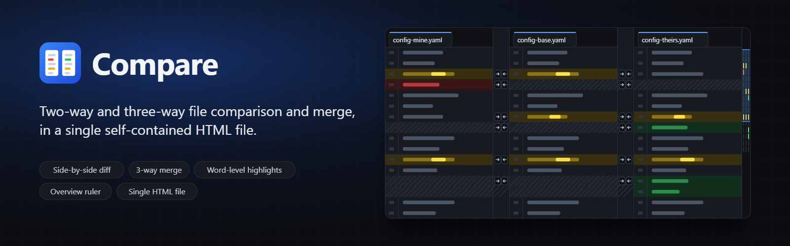

<p align="center">
  
</p>

# Compare

A file comparison and merge tool that runs entirely in the browser. It is a single `index.html` with no dependencies, no build step and no install: download it, double-click it, done.

## Features

- **Side-by-side comparison** with aligned line numbers. Changed lines are highlighted with word-level differences, added and removed lines are colour coded, and padding rows keep both sides lined up.
- **Three-way mode** adds a centre pane. Differences are shown between adjacent panes and rows are aligned through the centre, which suits a common-ancestor workflow (mine | base | theirs).
- **Merging** with arrows in the gutter between panes to copy a block either way, plus undo and redo.
- **Mirrored file tabs.** Every open file appears as a tab in each pane. Pick a file in each pane and they compare with each other.
- **Overview ruler** on the right: a thumbnail of each file with the differences marked, the visible region outlined, and click or drag to scroll.
- **Navigation** between differences with buttons, keyboard shortcuts, or by clicking a block.
- **Options** to ignore whitespace, ignore case, wrap lines, and show only differences with collapsible context.
- **Save** either side back to a file, preserving line endings and trailing newline.
- Light and dark themes, drag and drop, and an editor dialog for pasting text.

## Usage

Open `index.html` in any modern browser. Then:

1. Open files with **Open files…**, drop them onto the page, or press **Edit** in a pane to paste text.
2. Pick a file in each pane from the tab strip. Switch between **2-way** and **3-way** in the toolbar.
3. Move between differences with **Prev** / **Next** or `Alt+↑` / `Alt+↓`.
4. Copy a block between panes with the gutter arrows, or `Ctrl+→` / `Ctrl+←` for the current block. `Ctrl+Z` undoes.
5. Press **Save** in a pane to download the merged result.

The **Sample** button loads a base file and two edited versions so you can try everything without your own files.

## How it works

Lines are compared with a Myers diff, anchored on lines that are unique to both files (patience style) so large files diff quickly and sensibly. Changed line pairs get a second, word-level diff for the highlights. In three-way mode the two pairwise alignments are combined through the centre pane. Everything happens locally in the page; no file ever leaves your machine.

## Development

There is nothing to build. The optional scripts in `tools/` regenerate the icon, social card and banner:

```bash
python tools/make_assets.py        # writes the SVG sources to assets/
python tools/serve.py              # then open http://localhost:8766/tools/render.html to render PNGs
python tools/make_assets.py ico    # rebuilds assets/favicon.ico from the rendered PNGs
```
